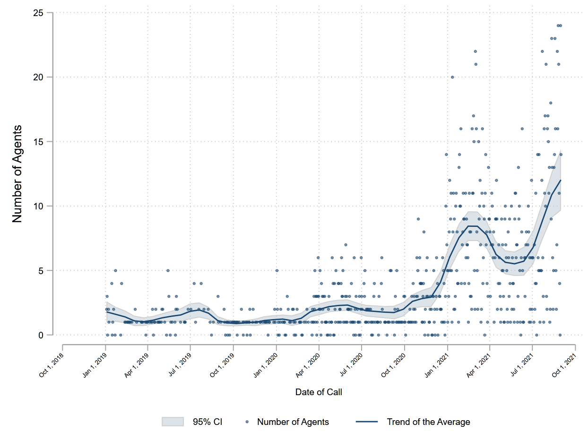
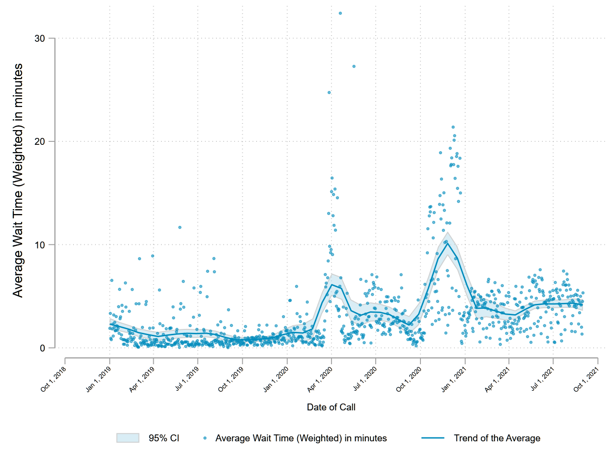
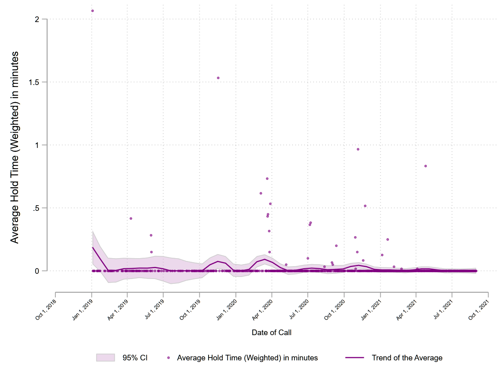

```{r setup, include=TRUE}
knitr::opts_chunk$set(echo = TRUE, class.source = "watch-out")
```

```{css, echo=FALSE}
.watch-out {
  background-color: 	#edf0f5;
  border: 2px #80d7ff;
    }
```

<style>
    pre {
        border: 0;
    }
</style>

# Analysis of 2-1-1 Calls 

This analysis provides insights on the trends of 2-1-1 calls between the years 2019 and 2021.

The analyses uses the raw 2-1-1 call logs data and models the trends of key indicators


The data processing and modeling code is available as STATA do files in 
"S:\CHHS\MYDEPT\PRIVATE\Thomas_CoordinatedEntry\2021-coordinated-entry-analysis\Analysis\Do Files"

The report below gives a general description of the measurement and the output figures 


## Measuring Call Statistics

THe raw data contained daily averages of call handle time, wait time, hold time between 
January 2019 and September 2021.

## Aggregate Inbound and Callback times by date and Calculate Weighted Averages. 

The dataset includes average times for inbound calls and callbacks in separate rows. 
The average for a given indicator, say, average call time is the average of both inbound
and callback times. Since each of these two types is reported as a daily average with
different volume of calls, we calculate the overall average of the two by 
weighting inbound and callback averages by the respective number of calls. 

Formula -  Weighted_calltime = avg_inbound##inboundcalls + avg_callback##callbackcalls) / total calls

## Modeling the Trends in Key Indicators

Each indicator was plotted across time and a local polynomial smoothing trend was modeled to represent the moving average of the indicators across time. Following figures show the local averages that could be interpreted as average for specific periods within the time span of the data.

### Calls - English


### Calls - Spanish


### Agents - English


### Agents - Spanish




### Call Length - English


### Call Length - Spanish


### Wait time - English




### Wait time - Spanish


### Hold time - English


### Hold time - Spanish




